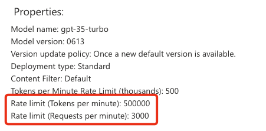

# Azure OpenAI rate limits

Azure OpenAI model deployments have two limits, the first being tokens per minute, and the second being requests per minute. You are most likely to hit the Tokens per minute limit especially as you scale up the number of users using the system.

Tokens per minute is the total number of tokens you can generate per minute. The number of tokens per call to OpenAI Chat API is the sum of the Max Token parameter, plus the tokens that make up your msg (system, assistant, and user), plus best_of parameter setting.

For example, you have a model deployment rated at 500K tokens per minute.

If users set the Max Token parameter to 2048, with a message of 200 tokens, and you have 100 concurrent users sending on average 6 messages per minute then the total number of tokens per minute would be (2048 + 200) * 6 * 100) = 1348800 tokens per minute. This is well over the 500K tokens per minute limit of the Azure OpenAI model deployment and the system would be rate-limited and the user experience would be poor.

This is where the MaxTokenCap is useful for an event. The MaxTokenCap is the maximum number of tokens per request. This overrides the user's Max Token request for load balancing. For example, if you set the MaxTokenCap to 512, then the total number of tokens per minute would be (512 + 200) * 6 * 100) = 427200 tokens per minute. This is well under the 500K tokens per minute limit of the Azure OpenAI model deployment and will result in a better experience for everyone as it minimizes the chance of hitting the rate limit across the system.

MaxTokenCap is set at the event level and is configured in the Azure Storage Account table named `playgroundauthorization`. See the section above on [adding an event](#adding-an-event) for more details.
